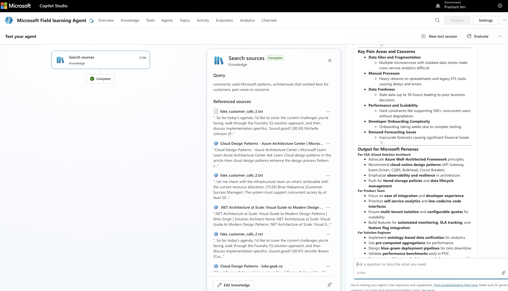

# TechConnHackFest-project

# Microsoft Field learning Agent

## Overview

Goal is to capture all best practices, customer challenges / feedback, reference architectures from the field and use this as grounding to scale our field.

## Agent usage

- Plug-in listener agent in - when field having conversations with customer
- Supply call transcripts or recordings as input to this agent.

## Tools & Config

- Microsoft Copilot Studio
- MCPs

## View Agent output

